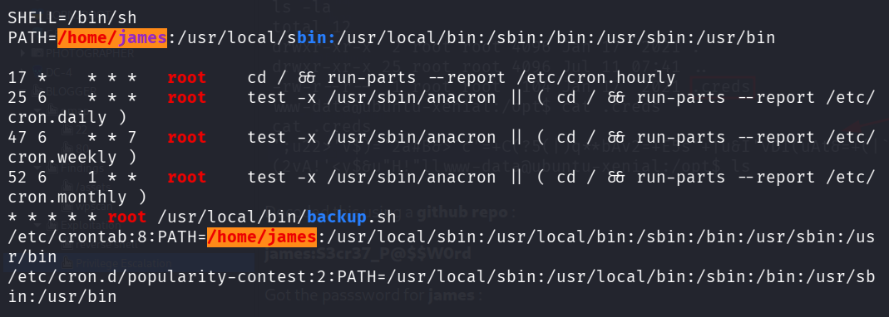
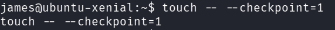
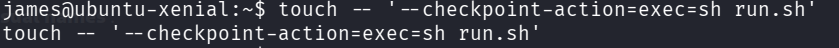
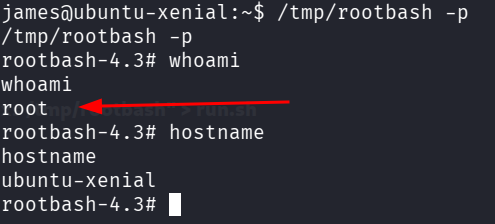

::: page
# Privilege Escalation 2 {#privilege-escalation-2 .title}

\

Ran linpeas in james and got this :

Looking at the last line **( \* \* \* \* \* ),** shows that a **cron job
is running every minute as root**. And it has **/home/james in its path
first**, meaning that linux will search for the executable

in the **/home/james directory first before any other place**.

**Lets abuse this feature.**

Lets look at the content of **backup.sh** :

**#!/bin/sh**

**cd /home/james/**

**tar czf /tmp/backup.tar.gz \***

When a linux shell sees an **asterix ( \* )**, it performs **globbing
(wildcard expansion)**.

Basically, before the **tar** program even runs, the **shell looks at
every other file inside /home/james** and **expands that single \* into
a long list of filenames** seperated by spaces.

If the directory contains files **file1.txt** , **file2.txt** and
**run.sh**

The shell rewrites the command behind the scenes to look like this :

**tar czf /tmp/backup.tar.gz file1.txt file2.txt run.sh**

And from **tar man page** we know about **2 features** :

**\--checkpoint** : A **feature used to track progress** on massive
backups.

**\--checkpoint-action** : A feature that lets administrators **trigger
a reaction** when a checkpoint is hit.

So lets use this to our **advantage** :

By using **touch** we created **two files with unusual names** :

**\--checkpoint=1**

**\--checkpoint-action=exec=sh run.sh**

Now when the cron job runs, the command physically transforms into :

**tar czf backup.tar.gz \--checkpoint=1 \--checkpoint-action=exec=sh
run.sh**

This makes the tar program **read the line as configuration flags and
not files**.

**This makes root execute run.sh**.

Now we made a file called **run.sh** :

**echo \"cp /bin/bash /tmp/rootbash; chmod +xs /tmp/rootbash\" \>
run.sh**

Now we waited for 1 min and executed :

**/tmp/rootbash -p**

**Got root !!!**
:::
