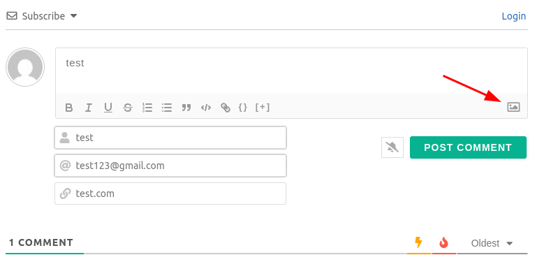
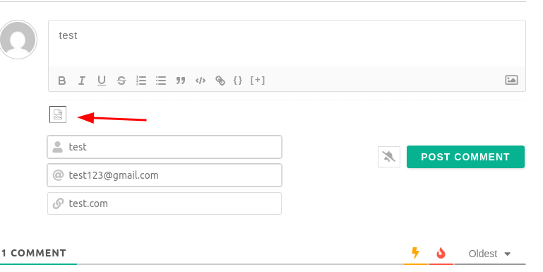
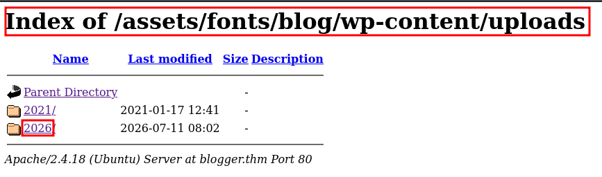
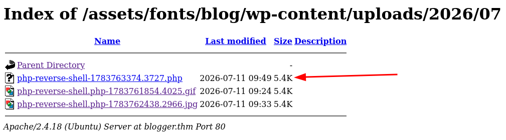
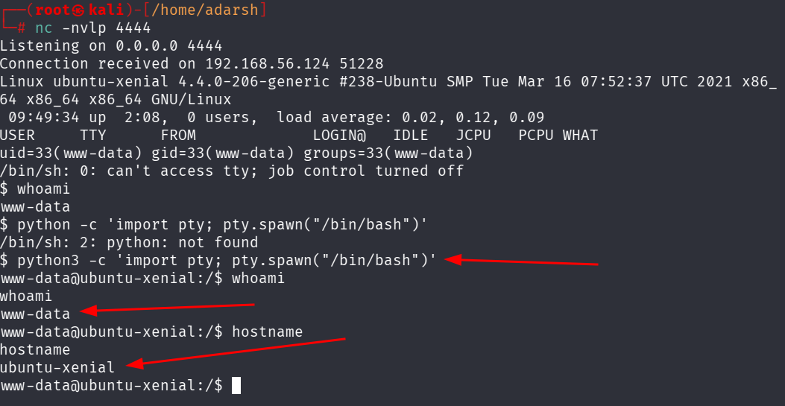

::: page
# reverse shell {#reverse-shell .title}

\

We tried to upload a reverse shell here :

But we **were denied** even if i **changed the file extension to .jpg**

Lets try to **change the file contents abit to bypass** this :

Since images are allowed, **gif** will be allowed as well. So we used
**GIF89a;** at the **start of the php-reverse-shell file** and were able
to upload.

Lets **catch a shell** :

Lets find where the upload went first :

**gobuster dir -u** **<http://blogger.thm/assets/fonts/blog/>** **-w
/usr/share/wordlists/dirbuster/directory-list-2.3-medium.txt**

We found :

Here, the file extension is **.php**, only the **start of the file was
changed during upload.**

**We caught a shell :**

:::
