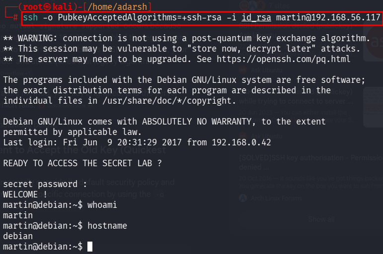

::: page
# id_rsa {#id_rsa .title}

\

We **copy the rsa private key into id_rsa** and give it **600**
permission.

Priviously we had a list of names : **martin,hadi,jimmy**

Lets ssh :

We had to use this **-o PubkeyAcceptedAlgorithms=+ssh-rsa** flag because
our **modern Kali Linux SSH client (running OpenSSH 10.1+)** has
disabled the **legacy ssh -rsa**

**signature algorithm** by default due to **security vulnerabilities in
SHA-1**.

Because they cannot **agree on a signature method**, the **key is
ignored,** and the server falls back to **asking for a password.**
:::
