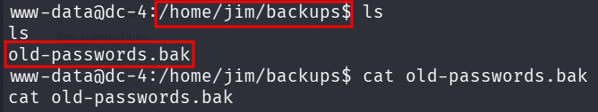
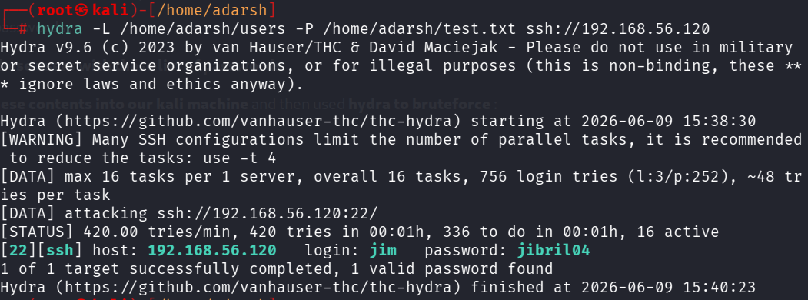
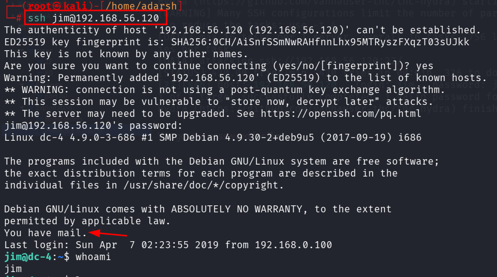
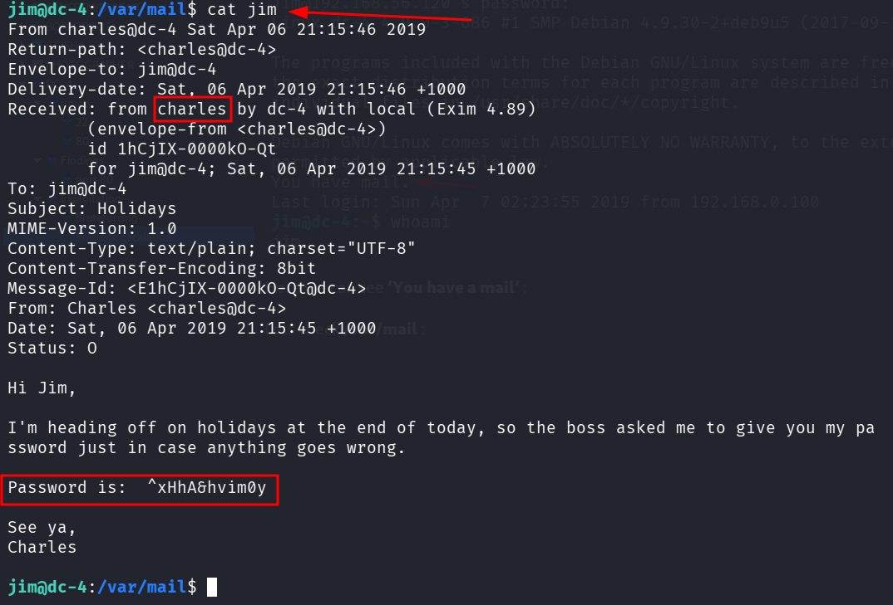
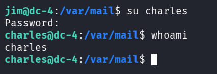
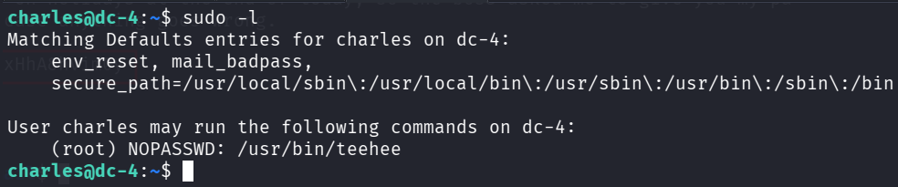
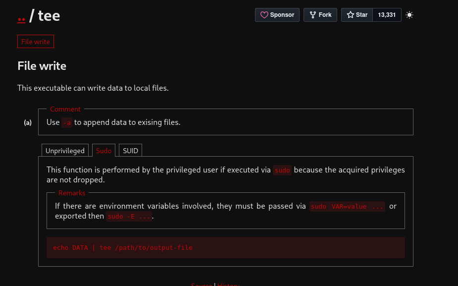
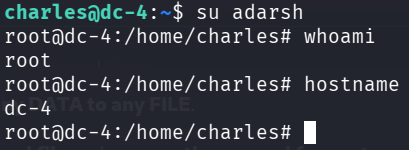

::: page
# Privilege Escalation {#privilege-escalation .title}

\

Now we enumerated and found 3 users :

**charles**

**jim**

**sam**

Inside jim :

This has a long list of passwords :

**Lets bruteforce for these users with these list of passwords**:

We **copied both of these contents into our kali machine** and then used
**hydra to bruteforce** :

We got the password for **jim** :

Here we can see **'You have a mail'** :

Lets check **/var/mail** :

We have the **password for charles** :

We checked for **sudo -l** :

Searched for **teehee** and found this :

Here, the **privileged user can write any DATA to any FILE**.

We will use this to **alter the /etc/passwd file** and **remove the
passwd for root user** completely.

This is the original : **root:x:0:0:root:/root:/bin/bash**

Altered : **adarsh::0:0:::/bin/bash**

Lets do this using the **syntax above** :

**echo \"adarsh::0:0:::/bin/bash\" \| sudo teehee -a /etc/passwd**

**We are root!!!**
:::
