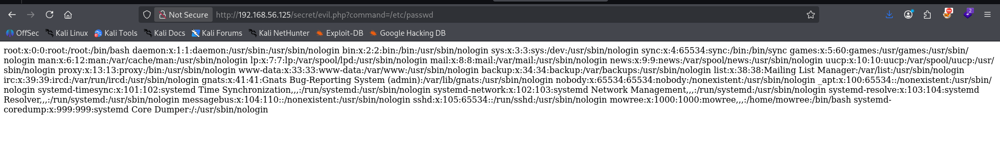
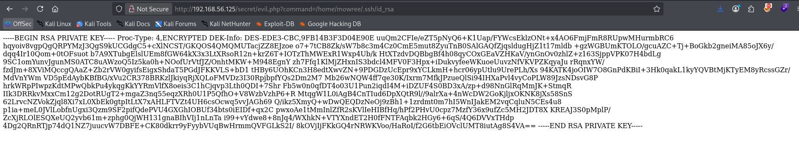

::: page
# LFI {#lfi .title}

\

**LFI is possible.**

Also found a user named **mowree**.

**Tried to get id_rsa for mowree** :

Got this RSA key and copied the correct format from the **page source**.
:::
