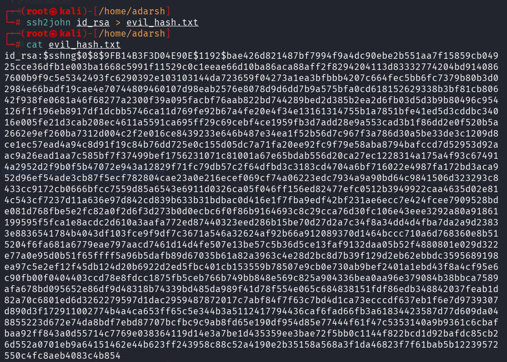
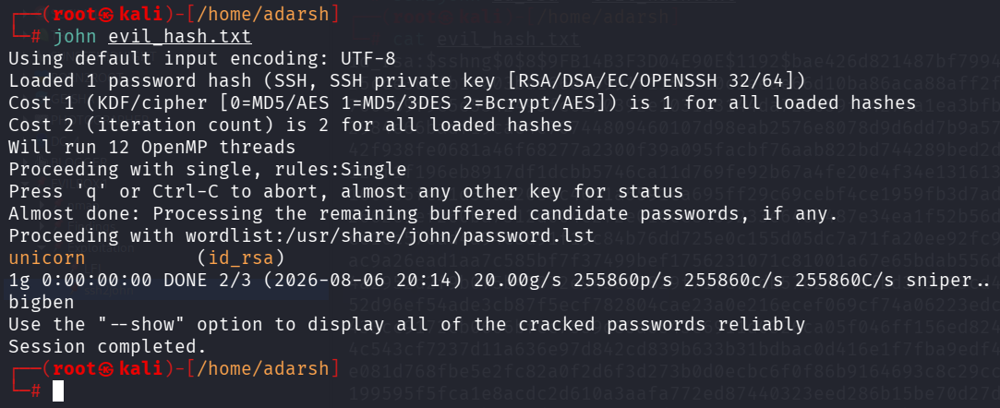
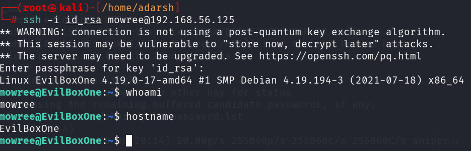

::: page
# ssh2john {#ssh2john .title}

\

Now, the **id_rsa was encrypted** so we used **ssh2john to convert this
into a hash** and then **crack that hash using john**.

Now lets crack this hash using john :

**We got the password.**

We got a **low level user.**
:::
