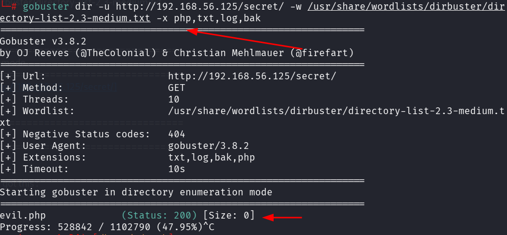

::: page
# gobuster {#gobuster .title}

\

└─# gobuster dir -u 192.168.56.125 -w
/usr/share/wordlists/dirbuster/directory-list-2.3-medium.txt

===============================================================

Gobuster v3.8.2

by OJ Reeves (@TheColonial) & Christian Mehlmauer (@firefart)

===============================================================

\[+\] Url: <http://192.168.56.125>

\[+\] Method: GET

\[+\] Threads: 10

\[+\] Wordlist:
/usr/share/wordlists/dirbuster/directory-list-2.3-medium.txt

\[+\] Negative Status codes: 404

\[+\] User Agent: gobuster/3.8.2

\[+\] Timeout: 10s

===============================================================

Starting gobuster in directory enumeration mode

===============================================================

secret (Status: 301) \[Size: 317\] \[\--\>
<http://192.168.56.125/secret/%5D>

server-status (Status: 403) \[Size: 279\]

Progress: 220558 / 220558 (100.00%)

===============================================================

Finished

===============================================================

Used a flag **-x (extension)** for gobuster and got this :

**Lets check evil.php**

**It also came empty**
:::
