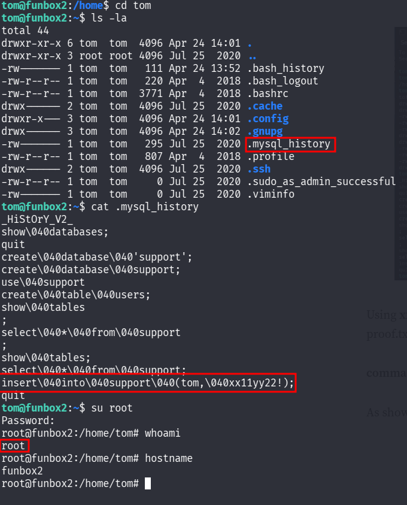

::: page
# rbash escape {#rbash-escape .title}

\

We are **inside user tom**.

We tried to do **lateral movement** but were restricted due to
**rbash**, so we **escaped rbash using vi editor** :

Opened vi and typed :

**:set shell=/bin/bash**

**:shell**

We **escaped rbash**.

Now we did some lateral movement and found a **.mysql_history hidden** :

We opened it and **saw something that could be a password** :
**xx11yy22!**

**We are root!!!**
:::
