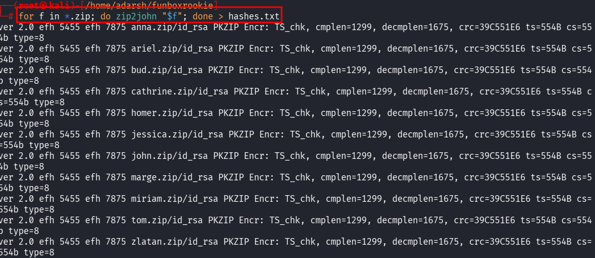
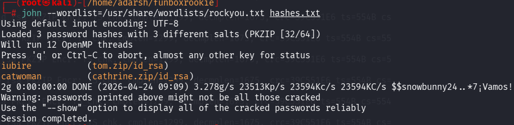
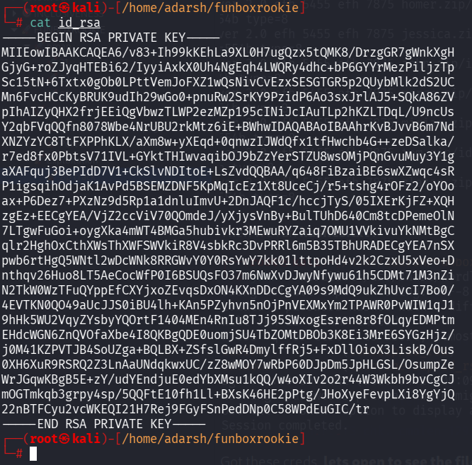
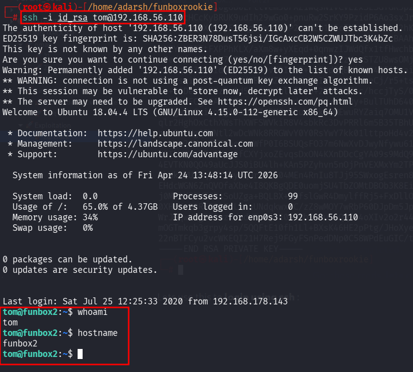

::: page
# zip crack {#zip-crack .title}

\

We used to **john** to crack these **password protected zip files**.

We **converted all the zip files to .txt** so that **john can understand
it** :

Then we ran **hashes.txt** :

Got these creds, **lets open to see the file content**.

We **unzipped tom and found this id_rsa** :

Lets use this to **login using ssh** :

We got a **user tom**.
:::
