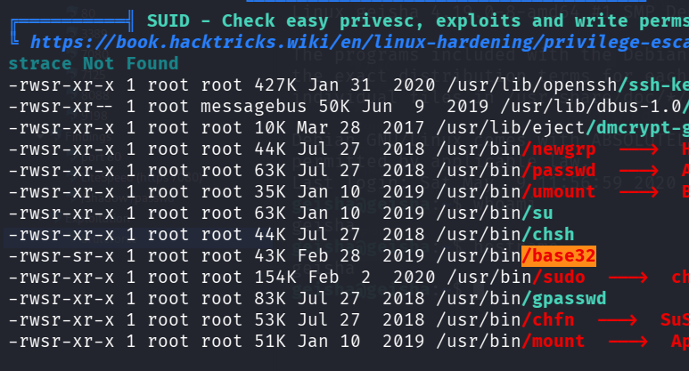
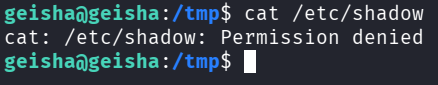
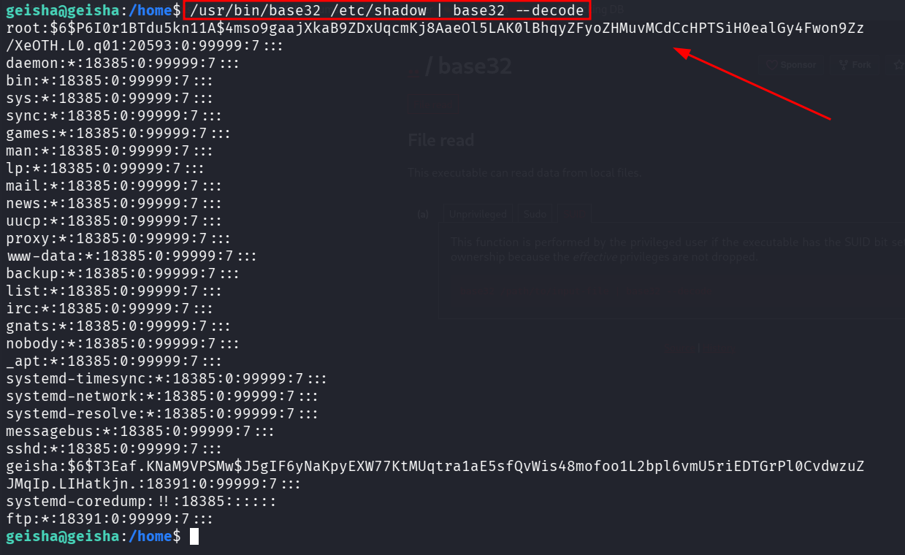
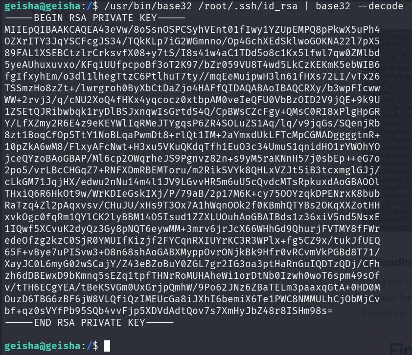
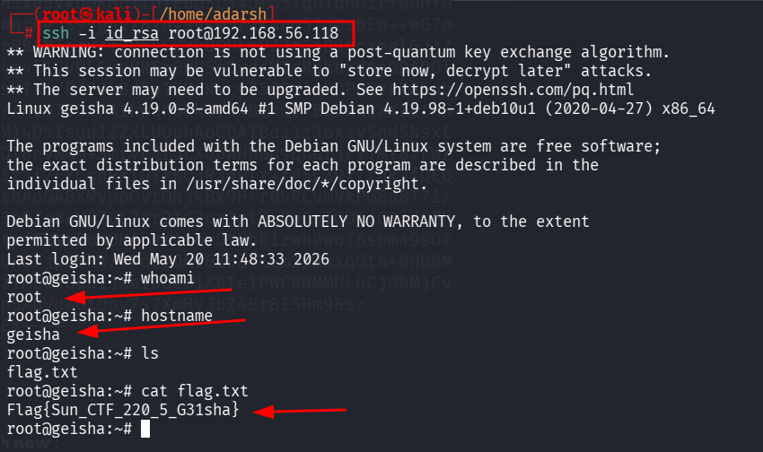

::: page
# Privilege Escalation {#privilege-escalation .title}

\

We got **linpeas into the machine** :

Found this :

According to this **/base32 suid bit set** we can **read any sensitive
file on the system**.

We saw this :

Lets use **GTFObins to read this** :

**We got the hash of the root\'s password**.

We tried to **crack the hash** but **werent able to.**

Lets search for any **ssh keys**.

**/usr/bin/base32 /root/.ssh/id_rsa \| base32 \--decode**

This is the **root ssh key**, lets **ssh now** :

**We are root!!!**
:::
