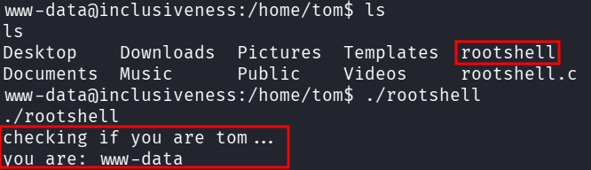
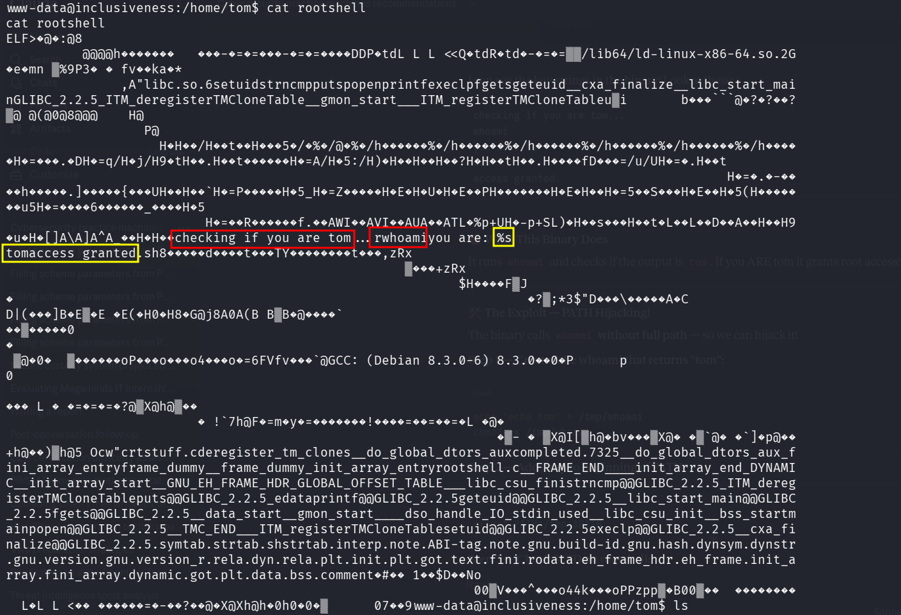
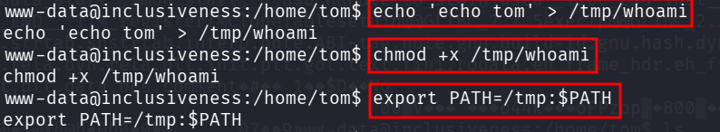
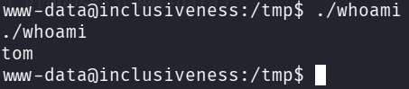
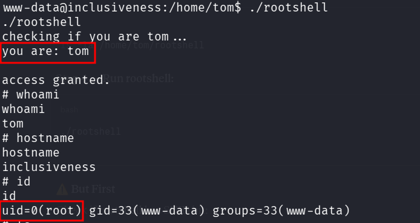

::: page
# Privilege Escalation {#privilege-escalation .title}

\

Inside **www-data we did some enumeration** and found this inside
**tom** :

This rootshell is a binary when ran :

It runs **whoami** and **checks what the user is**, if the user is
**tom** it **grants access**, else **it doesnt**.

Also, this binary **calls whoami without full path** and hence **we can
do path hijacking!!!**.

Lets create a **fake whoami** which returns **tom** , after that we give
it **execute perm**, then we **add /tmp to the beginning of path** :

NOTE THAT WHEN WE EXECUTE **WHOAMI IT RETURNS TOM** :

Lets execute **rootshell now** :

**We are root!!!**
:::
