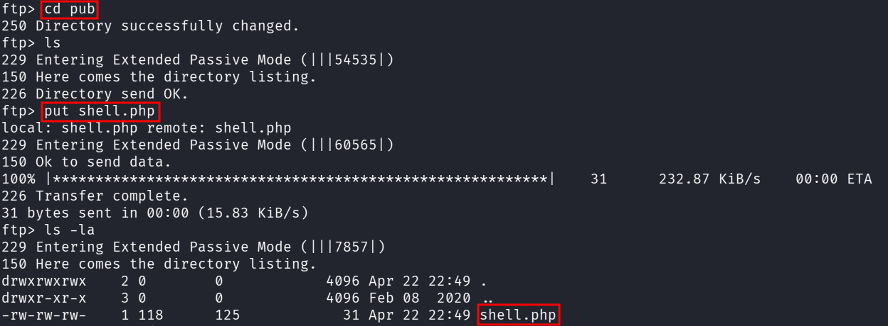

::: page
# write into ftp {#write-into-ftp .title}

\

We saw from nmap that **ftp has write permissions**, so we created a
file in our kali called **shell.php** :

Now, we **put** this file into **ftp** :

:::
