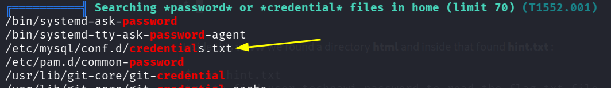
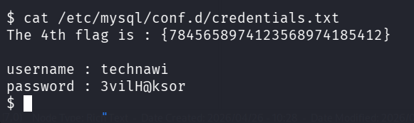
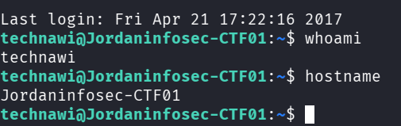
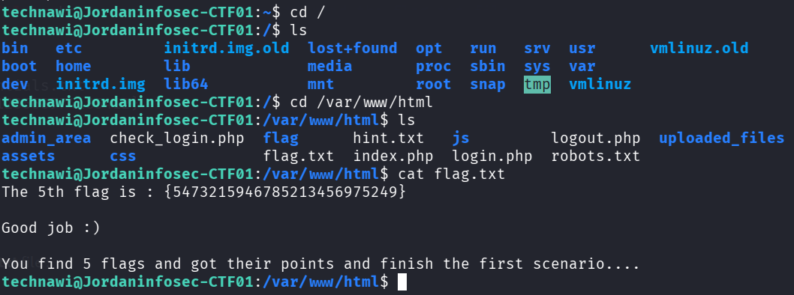

::: page
# Lateral movement {#lateral-movement .title}

\

Transferred l**inpeas to the shell and ran it**, and found an
interesting **credentials.txt file** :

Lets see whats inside :

We got **Technawi Password**.

Lets ssh into **technawi** and read the **flag.txt** file :

We got all **flags!!!**.
:::
