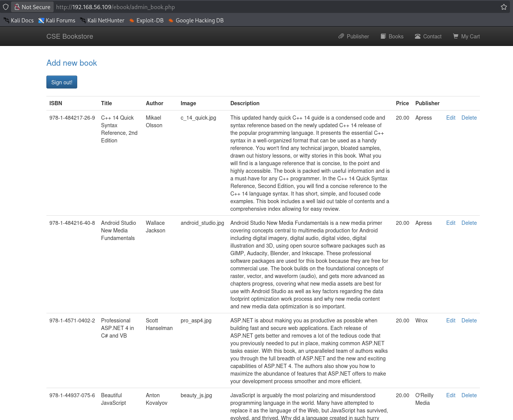
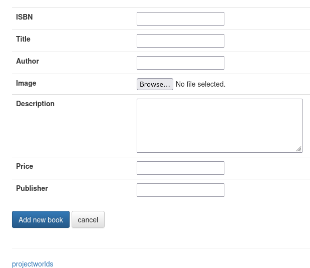
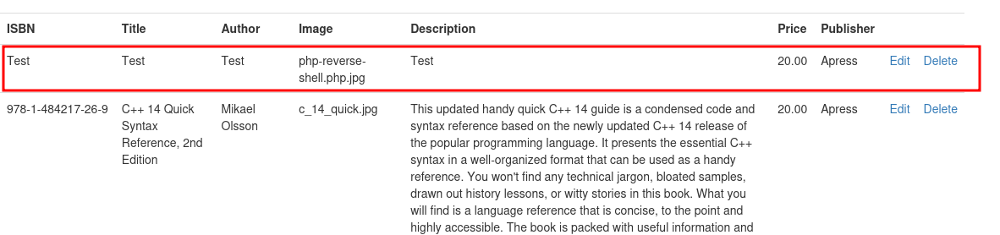

::: page
# admin login {#admin-login .title}

\

Used simple creds **admin : admin** and was lucky to log in :

Here , we tried to add a new book :

Tried to upload a **php reverse shell** but got an SQL error, so changed
the file name to **.php.jpg** and also **copied the same names** of
**author** and **publisher** :

Our book is **uploaded**.
:::
