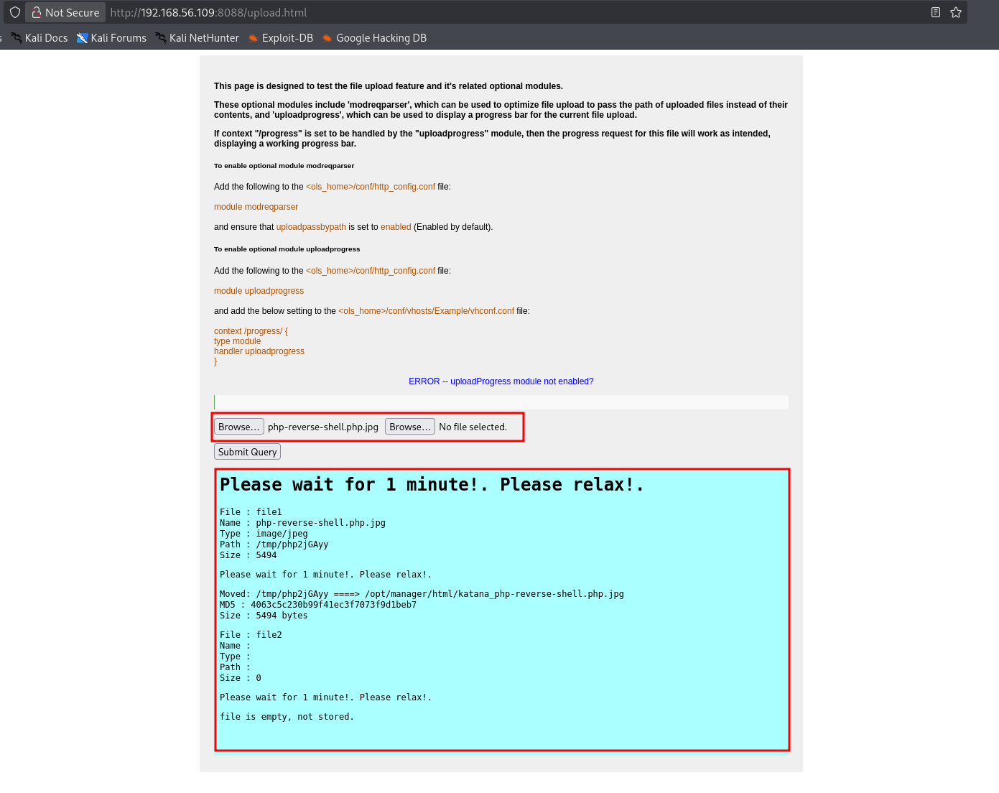
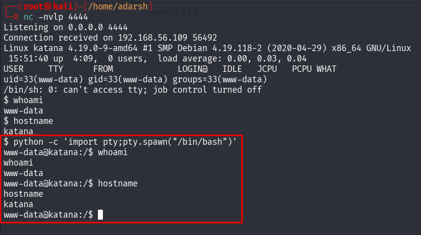

::: page
# upload.html (8088) {#upload.html-8088 .title}

\

Used **dirbuster (8088) and searched for php,html.txt files** since we
reached dead end.

Found something **interesting** at **upload.html** :

Here we can see that our upload is being **transferred to some other
location**.So we tried to catch using
(<http://192.168.56.109:8088/katana_php-reverse-shell.php>)

But **couldnt catch a reverse shell**.

We tried to use **8715** and we successfully **popped a shell**
(<http://192.168.56.109:8715/katana_php-reverse-shell.php>) :

We got a **low level user!!!**.
:::
