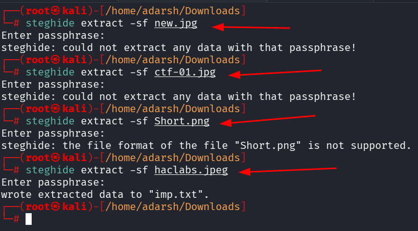
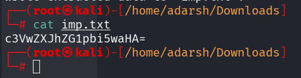
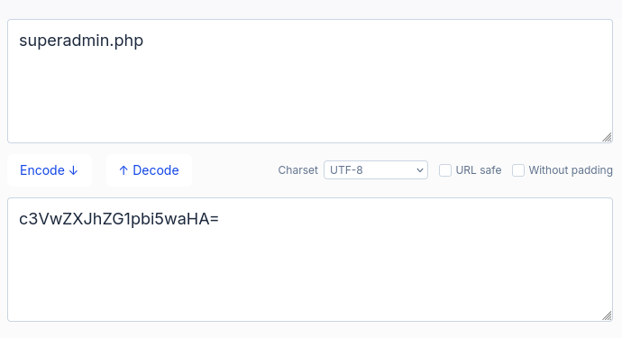
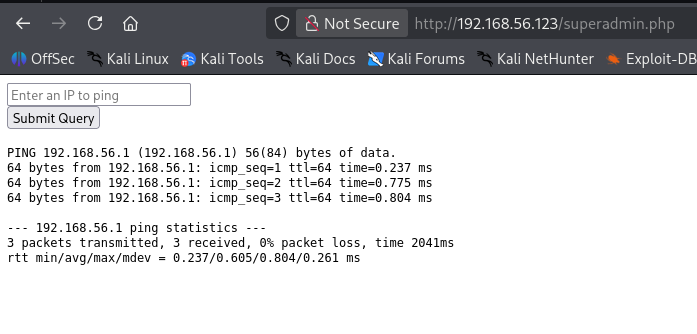

::: page
# steghide {#steghide .title}

\

Since nothing was found after enumerating the /admin directory as well,
we checked if the images have any hidden files in them.

We used a tool called \"**steghide**\" :

Lets see whats inside **imp.txt**.

Lets crack this **base64 hash** :

This looks like a **directory**.

This is executing **ping commands.**
:::
