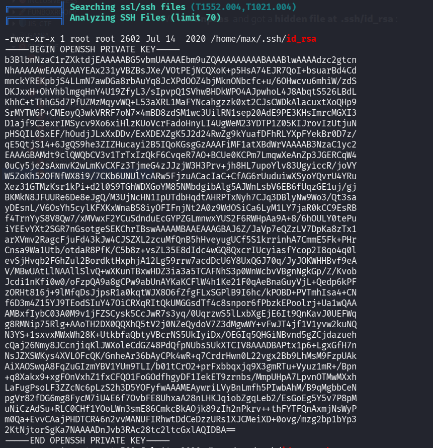
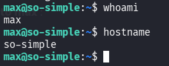

::: page
# Privilege Escalation {#privilege-escalation .title}

\

We tried to **enumrate the user** but everything was a **rabbit-hole**
and nothing useful was found.

We ran **linpeas** and got a **hidden file at .ssh/id_rsa** for user
**max**:

Lets use this to **ssh into max** :

We got a **foothold**.
:::
