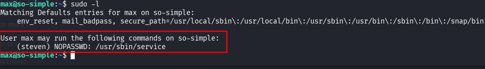
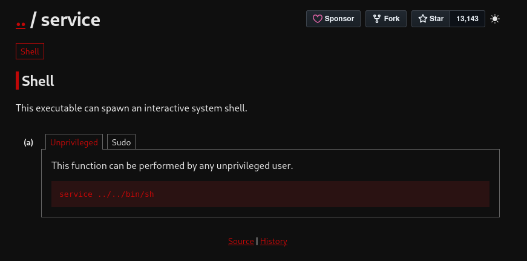
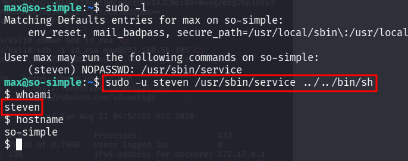
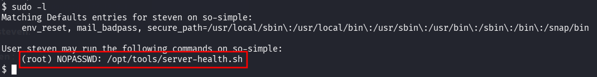
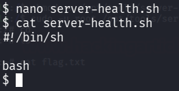
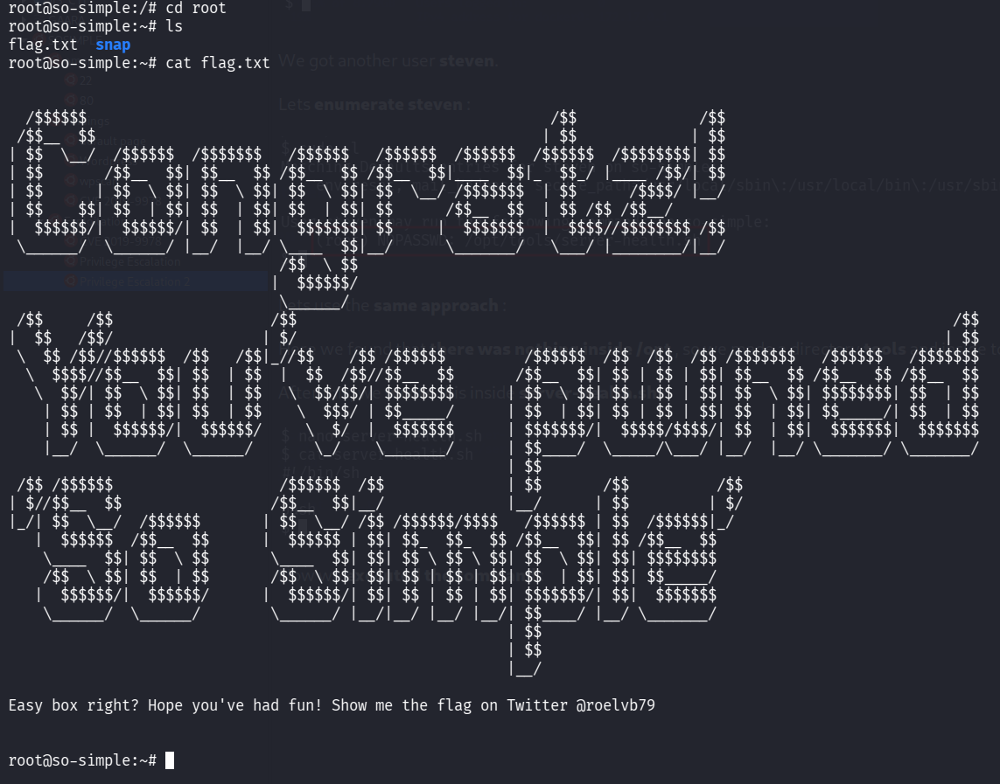

::: page
# Privilege Escalation 2 {#privilege-escalation-2 .title}

\

Here we did **sudo -l** and found this :

We got **something on gtfobins** :

Lets **try this out** :

We got another user **steven**.

Lets **enumerate steven** :

Lets use the **same approach** :

Here we found that **there was nothing inside /opt** , so we made a
directory **tools** and inside tools made a file **server.health.sh**.

After this, we **wrote** this inside **server-health.sh** :

Now we **executed the command** : **sudo -u root
/opt/tools/server-health.sh**

**We are root!!!**
:::
