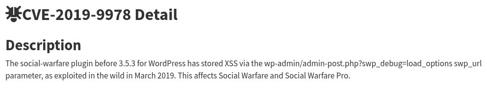

::: page
# CVE 2019-9978 {#cve-2019-9978 .title}

\

Thos is the **CVE** :

Social Warfare plugin for WordPress has a **Remote File Inclusion
(RFI)** vulnerability in versions before 3.5.3. It allows
unauthenticated attackers to execute arbitrary code by passing

a URL to a malicious payload file via the **swp_url** parameter.
:::
