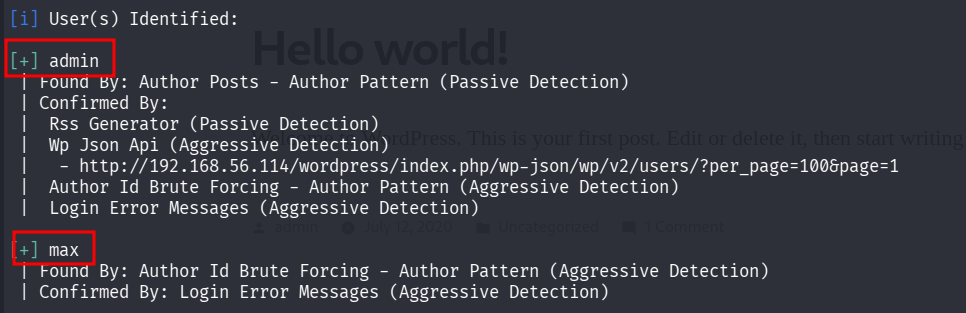
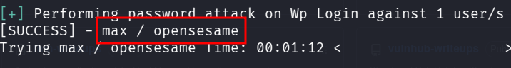
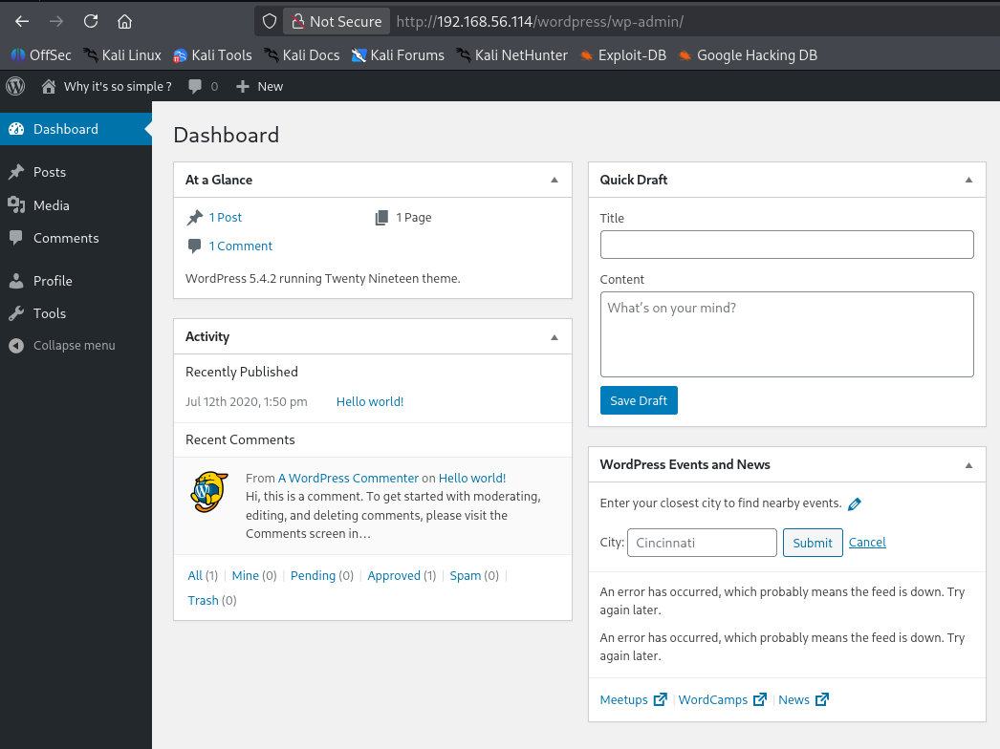
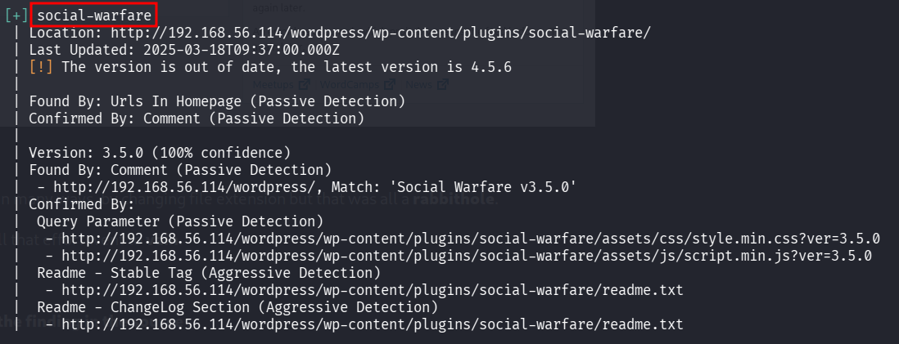
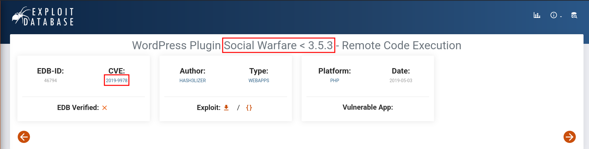

::: page
# wpscan {#wpscan .title}

\

We did wpscan for users and found this :

We tried to bruteforce for **user max** and got the **password** :

Lets see whats inside :

We are **logged in**.

We tried to **upload a reverse shell** in many ways, by changing file
extension but that was all a **rabbithole**.

User max had **no permissions** and all that effort went to **vain**.

Lets analyse the **wpscan again** :

We found this which o**verlaps with the finding in the source** :

These both **overlap, lets research about them**.

Found this on **exploitDB** :

:::
