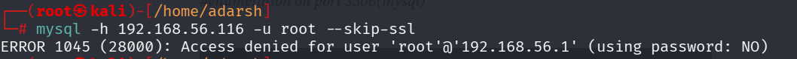
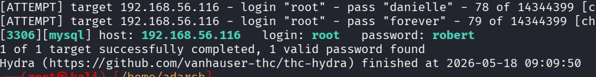
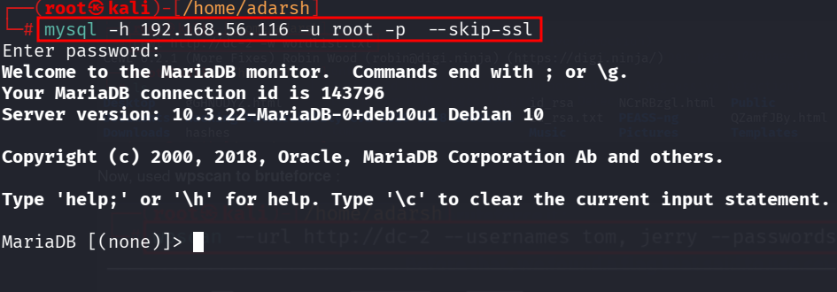
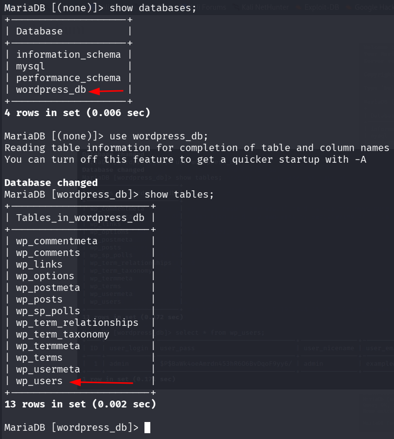
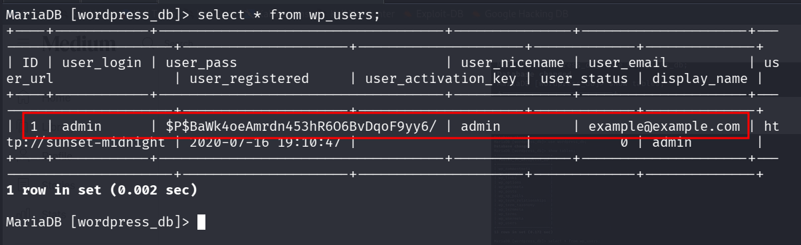
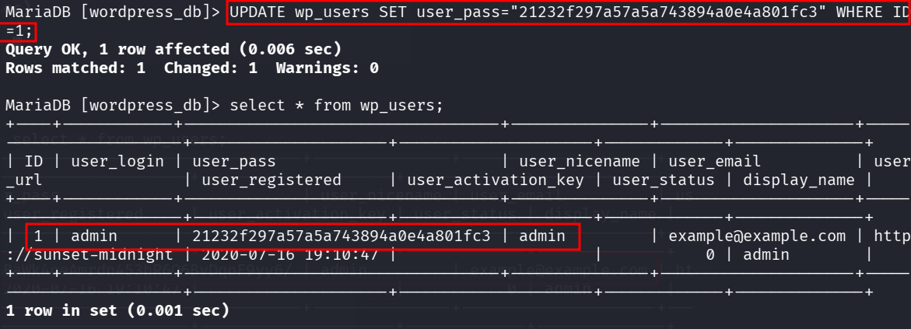

::: page
# mysql bruteforce {#mysql-bruteforce .title}

\

Since **nothing was found inside the wordpress**, **we switched our
focus to mysql**.

Checked for a **user root** : (here we skipped / disabled ssl checks)

This confirms a **user root exists**.

Lets **bruteforce into root** :

**hydra -l root -P /usr/share/wordlists/rockyou.txt 192.168.56.116 mysql
-V**

We got **credentials**.

**Lets login into mysql**.

**We logged in!!!**.

Lets **enumerate** :

Switched to **wp-users** :

We got the **admin password hash** but we **werent able to crack it**.

So lets **update the admins password** hash with our own **md5 hash**
for the password \'**admin**\'.

:::
