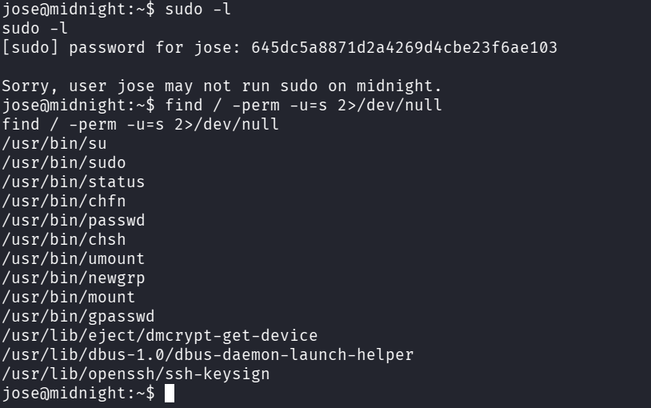
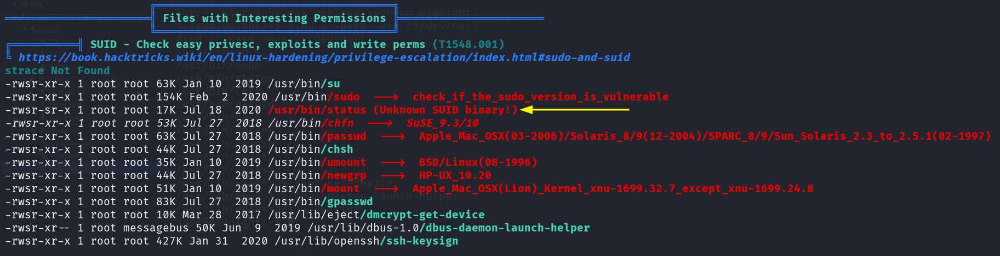
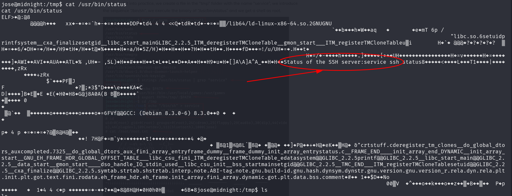
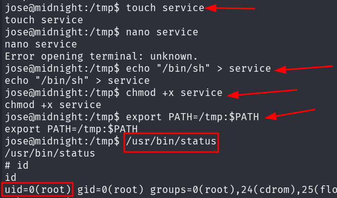

::: page
# Privilege Escalation {#privilege-escalation .title}

\

Tried **sudo -l** and **SUID sticky bit** :

**Transferred linpeas to the machine** :

Found this **interesting** :

**Unknown SUID sticky bit**.

**Lets run this binary** :

We can see that it is **running an ssh service**, but the **path is not
specified**.

We can exploit the **path of this service**.

**We dont have a service file so lets create one.**

**We got root!!!**

**IMPORTANT** :

PATH is an environment variable that instructs a Linux system in which
directories to search for executables.

The command **export PATH=/tmp:\$PATH** exports the environment variable
**PATH** to the value **/tmp:\$PATH**.

This means that the shell will now look for executable programs in the
directory **/tmp** first, before looking in any other directories.

The **environment variable PATH** is a list of directories that the
shell searches for executable programs when you type a command. It is
typically set to a list of standard directories,

such as **/usr/bin** and **/usr/local/bin**, but you can add or remove
directories from the list as needed.

Exporting an environment variable makes it available to **all child
processes of the current shell**. This means that any programs that you
launch from the current shell will also use

the **updated PATH variable.**
:::
