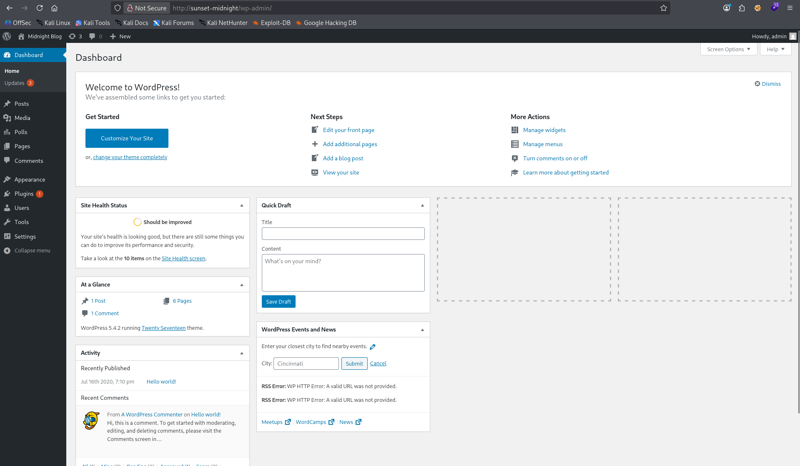
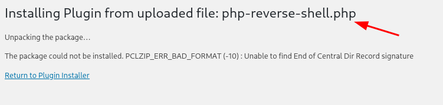
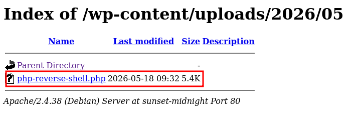
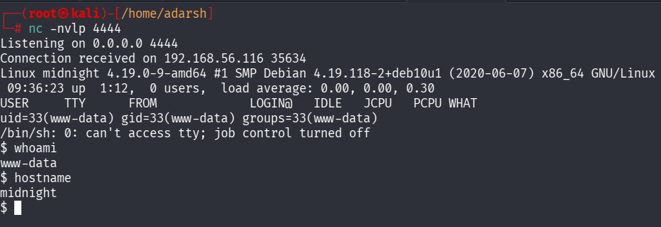
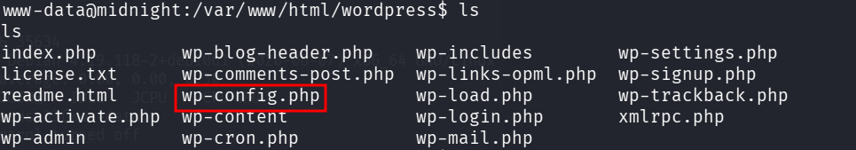
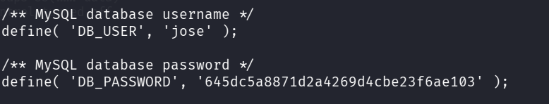
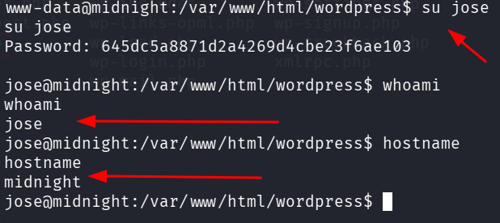

::: page
# Wordpress login {#wordpress-login .title}

\

**Lets use the credentials to login into wp now** :

**We got in!!!**

Lets **navigate to plugins** and upload a **php-reverse-shell**.

Navigating to the **/wp-content/uploads/** :

**Catch a reverse shell** :

**We got a low level user!!!**

Lets **enumerate** :

Inside **/var/www/html/wordpress** :

Lets see whats inside **wp-config.php** :

We tried this **user pass** :

Gor another **low level user!!!**
:::
