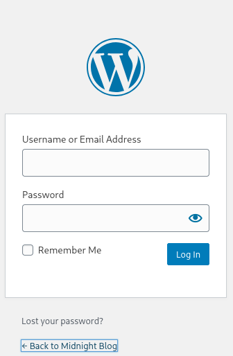

::: page
# wp-admin {#wp-admin .title}

\

Used **wp-scan and found this** :

\[+\] URL: <http://sunset-midnight/> \[192.168.56.116\]

\[+\] Started: Mon May 18 08:44:21 2026

Interesting Finding(s):

\[+\] Headers

\| Interesting Entry: Server: Apache/2.4.38 (Debian)

\| Found By: Headers (Passive Detection)

\| Confidence: 100%

\[+\] robots.txt found: <http://sunset-midnight/robots.txt>

\| Interesting Entries:

\| - /wp-admin/

\| - /wp-admin/admin-ajax.php

\| Found By: Robots Txt (Aggressive Detection)

\| Confidence: 100%

\[+\] XML-RPC seems to be enabled: <http://sunset-midnight/xmlrpc.php>

\| Found By: Direct Access (Aggressive Detection)

\| Confidence: 100%

\| References:

\| - <http://codex.wordpress.org/XML-RPC_Pingback_API>

\| -
<https://www.rapid7.com/db/modules/auxiliary/scanner/http/wordpress_ghost_scanner/>

\| -
<https://www.rapid7.com/db/modules/auxiliary/dos/http/wordpress_xmlrpc_dos/>

\| -
<https://www.rapid7.com/db/modules/auxiliary/scanner/http/wordpress_xmlrpc_login/>

\| -
<https://www.rapid7.com/db/modules/auxiliary/scanner/http/wordpress_pingback_access/>

\[+\] WordPress readme found: <http://sunset-midnight/readme.html>

\| Found By: Direct Access (Aggressive Detection)

\| Confidence: 100%

\[+\] Upload directory has listing enabled:
<http://sunset-midnight/wp-content/uploads/>

\| Found By: Direct Access (Aggressive Detection)

\| Confidence: 100%

\[+\] The external WP-Cron seems to be enabled:
<http://sunset-midnight/wp-cron.php>

\| Found By: Direct Access (Aggressive Detection)

\| Confidence: 60%

\| References:

\| - <https://www.iplocation.net/defend-wordpress-from-ddos>

\| - <https://github.com/wpscanteam/wpscan/issues/1299>

\[+\] WordPress version 5.4.2 identified (Insecure, released on
2020-06-10).

\| Found By: Rss Generator (Passive Detection)

\| - <http://sunset-midnight/feed/,>
\<generator\><https://wordpress.org/?v=5.4.2>\</generator\>

\| - <http://sunset-midnight/comments/feed/,>
\<generator\><https://wordpress.org/?v=5.4.2>\</generator\>

\[+\] WordPress theme in use: twentyseventeen

\| Location: <http://sunset-midnight/wp-content/themes/twentyseventeen/>

\| Last Updated: 2025-12-03T00:00:00.000Z

\| Readme:
<http://sunset-midnight/wp-content/themes/twentyseventeen/readme.txt>

\| \[!\] The version is out of date, the latest version is 4.0

\| Style URL:
<http://sunset-midnight/wp-content/themes/twentyseventeen/style.css?ver=20190507>

\| Style Name: Twenty Seventeen

\| Style URI: <https://wordpress.org/themes/twentyseventeen/>

\| Description: Twenty Seventeen brings your site to life with header
video and immersive featured images. With a fo\...

\| Author: the WordPress team

\| Author URI: <https://wordpress.org/>

\|

\| Found By: Css Style In Homepage (Passive Detection)

\| Confirmed By: Css Style In 404 Page (Passive Detection)

\|

\| Version: 2.3 (80% confidence)

\| Found By: Style (Passive Detection)

\| -
<http://sunset-midnight/wp-content/themes/twentyseventeen/style.css?ver=20190507,>
Match: \'Version: 2.3\'

\[+\] Enumerating Users (via Passive and Aggressive Methods)

Brute Forcing Author IDs - Time: 00:00:00 \<===================\> (10 /
10) 100.00% Time: 00:00:00

\[i\] User(s) Identified:

\[+\] admin

\| Found By: Author Posts - Author Pattern (Passive Detection)

\| Confirmed By:

\| Rss Generator (Passive Detection)

\| Wp Json Api (Aggressive Detection)

\| - <http://sunset-midnight/wp-json/wp/v2/users/?per_page=100&page=1>

\| Oembed API - Author URL (Aggressive Detection)

\| -
<http://sunset-midnight/wp-json/oembed/1.0/embed?url=http://sunset-midnight/&format=json>

\| Rss Generator (Aggressive Detection)

\| Author Id Brute Forcing - Author Pattern (Aggressive Detection)

\| Login Error Messages (Aggressive Detection)

\[!\] No WPScan API Token given, as a result vulnerability data has not
been output.

\[!\] You can get a free API token with 25 daily requests by registering
at <https://wpscan.com/register>

\[+\] Finished: Mon May 18 08:44:23 2026

\[+\] Requests Done: 51

\[+\] Cached Requests: 9

\[+\] Data Sent: 13.1 KB

\[+\] Data Received: 653.141 KB

\[+\] Memory used: 207.941 MB

\[+\] Elapsed time: 00:00:01
:::
