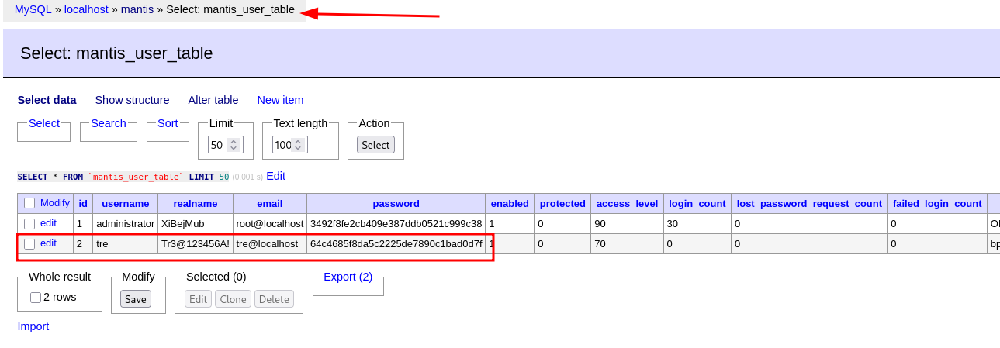
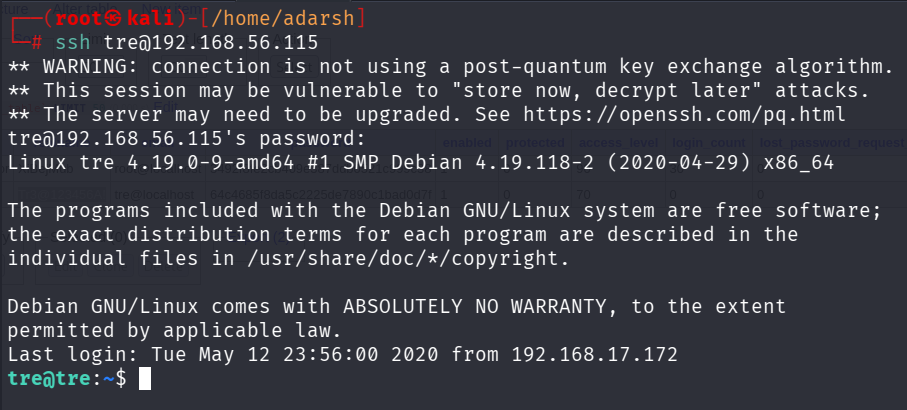

::: page
# mantiss ssh {#mantiss-ssh .title}

\

We got this table inside **mantiss** :

Lets **ssh into admin** :

We tried to **ssh into administrator but were not able to**.

Next we **ssh into user tre** :

We were **not able to ssh using the password given**.

We used **realname** as the **password** :

We got a low level user **tre** :

:::
