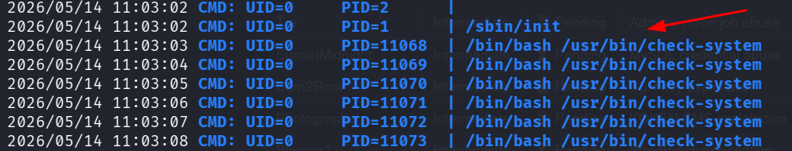
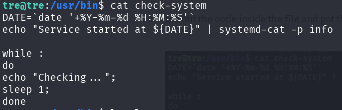
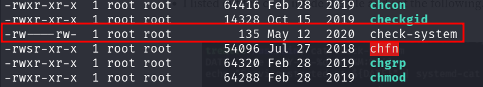
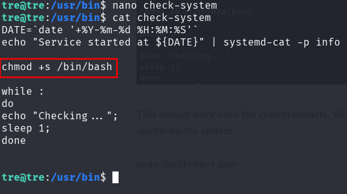
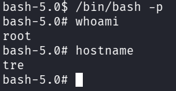
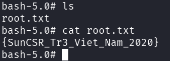

::: page
# Privilege Escalation {#privilege-escalation .title}

\

We **hosted the tranfers folder** and **transferred linpeas.sh** into
the shell.

We ran linpeas but **nothing interesting was found**.

We then transferred **pspy** to check for any **cron jobs**.

**Ran pspy** :

The process **check-system** is **running every second**.

Lets try to **abuse it** :

this is the **content of check-system** :

This is the process running :

It has **write permissions**.

**We will exploit this write permission to insert the suid sticky bit
for the command /bin/bash**.

We edit the script :

Now we **shutdown the system and restart it**.

**sudo shutdown -r now**

We restarted the system and ran **/bin/bash -p** (p for privilege) and
**got root** :

**We are root!!!**

:::
