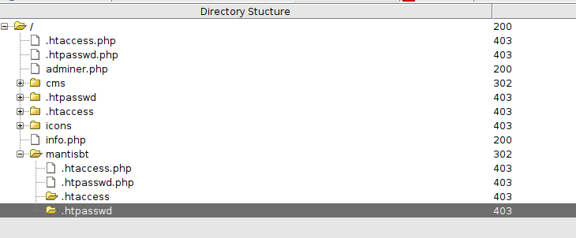
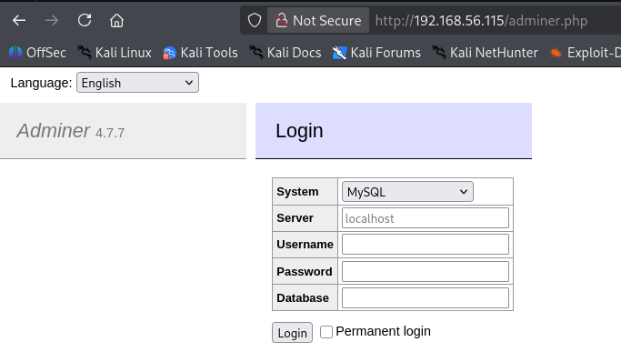
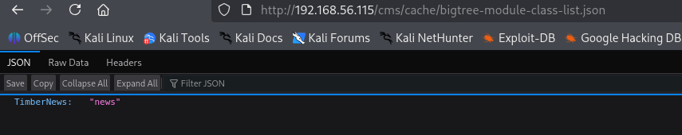
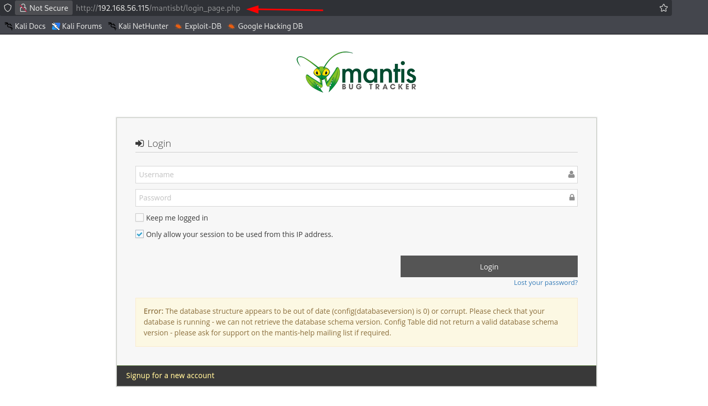
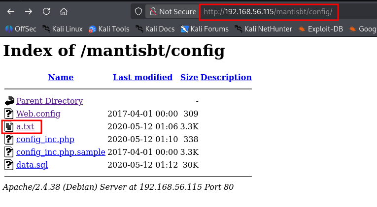
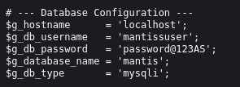
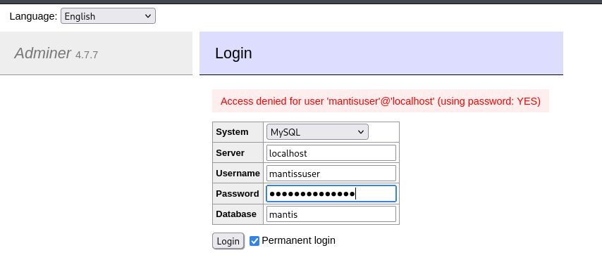

::: page
# dirbuster {#dirbuster .title}

\

Used dirbuster with a different type of wordlist
(**/usr/share/wordlists/dirb/big.txt**)

Got this :

Checked **adminer.php** :

Also checked **other directories** and found these :

rest all directories were restricted and were not interesting

Found this one :

Next we tried to **enumrate the mantis bug tracker using ffuf** and
found many **hidden directories**, but all those were just
**documentation**.

We found this interesting directory : **/config** :

Enumerated **a.txt** and found **database credentials** :

Lets use this **credentials**.

:::
